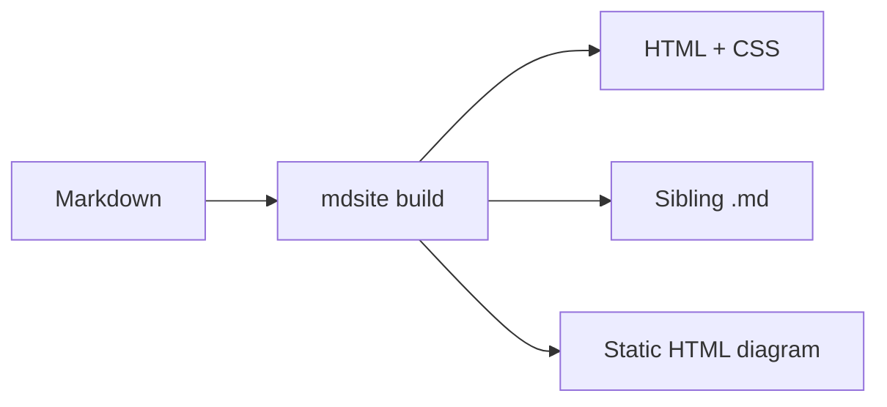

Minimal Markdown → HTML. This page is generated by CI and published on GitHub Pages.

## Basics

Hello **bold**, *italic*, and `inline code`.

- unordered one
- unordered two

1. ordered one
2. ordered two

A [link](nested_same_level.html) to a nested page.

A [link](nested/guide.html) to a nested page within a folder

A [link](nested_with_index/nested.html) to a nested page within a folder

## Some image


## Code

```rust
fn main() {
    println!("hello from mdsite");
}
```

```json
{
  "key": "value",
  "some": [
    "list",
    "item"
  ]
}
```

## Mermaid



Every HTML page also links to its Markdown source beside it.
