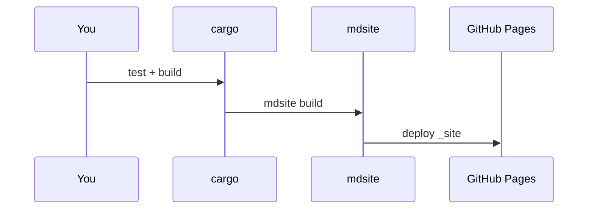

# Nested guide

Relative CSS and the Markdown source link should still work from this folder.

Back to [home](../index.html).

```mermaid
sequenceDiagram
  participant U as You
  participant C as cargo
  participant M as mdsite
  participant P as GitHub Pages
  U->>C: test + build
  C->>M: mdsite build
  M->>P: deploy _site
```
