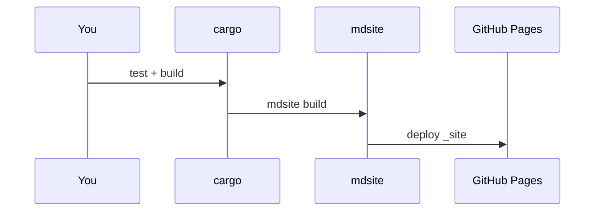
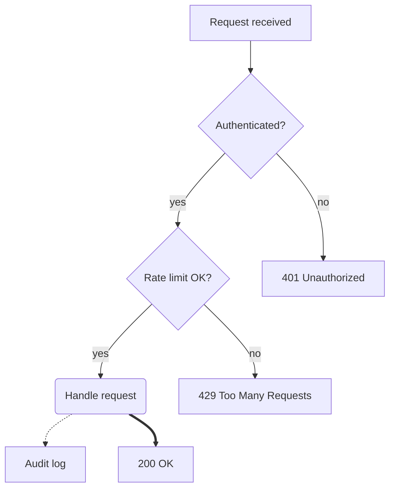
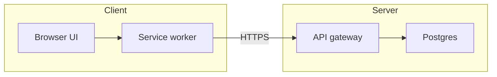

# Nested guide

Relative CSS and the Markdown source link should still work from this folder.

Back to [home](../index.html).



Here's the original example used by Simon Willison https://tools.simonwillison.net/grok-mermaid.

Good to compare to see if it looks the same




Sub Graphs



Unsupported
```mermaid
pie title Pets
  "Dogs" : 386
  "Cats" : 85
  ```
